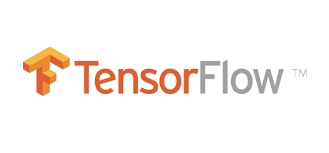

ICP-workshop-2018
=======

## Session I-TensorFlow introduction:

   

 

**TensorFlow**[^1] is an open-source software library for dataflow programming across a range of tasks. It is a symbolic math library, and also used for machine learning applications such as neural networks[^2].

[^1] https://www.tensorflow.org/

[^2] https://en.wikipedia.org/wiki/TensorFlow
